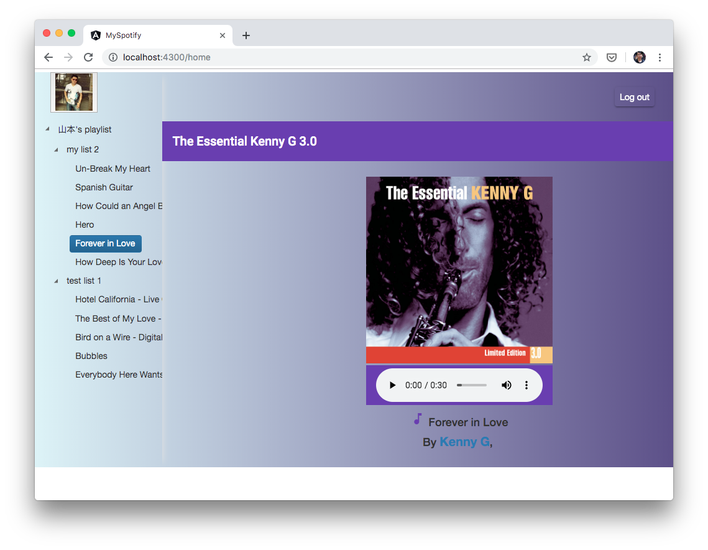

# SpotifyWrapper

This Angular application shows user's playlists once he logs into to his spotify account. When user selects a track from left-pane list, the track starts to play (only preview version due to DRM), and track details are displayed in right-side pane.

## Installation

1. Register the application with spotify
2. Go to project root directory and update 'Secrets.ts' with your spotify client id.
3. Run 'npm install' to install required 3rd party packages
4. Run 'npm run start' to load the application in development server 
Open the url http://localhost:4300 in your browser 
(You can change this url in package.json. And you need to update callback url in your spotify dev acount) 

## Build

Run `ng build` to build the project. The build artifacts will be stored in the `dist/` directory. Use the `--prod` flag for a production build.

## Running unit tests

Run `ng test` to execute the unit tests via [Karma](https://karma-runner.github.io).

## Running end-to-end tests
(Not implementated yet) 
Run `ng e2e` to execute the end-to-end tests via [Protractor](http://www.protractortest.org/).

## To do

1. Replace client side authentication with backend side one
2. Search function
3. Locate the searched tracks in other source(e.g youtube) and download and play them locally
4. docker image
5. ...

